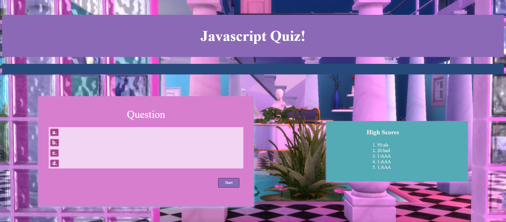

# Javascript-Quiz

 My personal objective in regard to this project was to create a fun but short javascript quiz, to familiarize myself with a few basic multiple choice questions and to strengthen my basic coding muscles. 

I started by creating a basic html with the question and answers formatted to render to an ul, though the question and answers were in separate divs. I wrote my javascript utilizing many array and object operations to render questions, and collect feedback through button clicking. High scores are stored in local storage. After making sure the functionality worked, I had fun sprusing up the css with a funky vaporwave aesthetic.

 The time spent on the project reinforced many previously learned concepts about array operations, and being VERY careful with my variable names and object property names. 

 
 

## Click the links below to access the page and repository respectively.
 

 - [Javascript Quiz Page](https://andis90.github.io/Javascript-Quiz/)
 

- [Javascript Quiz Repository](https://github.com/AndiS90/Javascript-Quiz)
 

 

## **Credits**
 
 

### [License](./assets/License.txt)

 